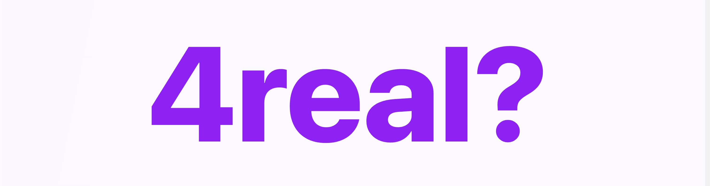
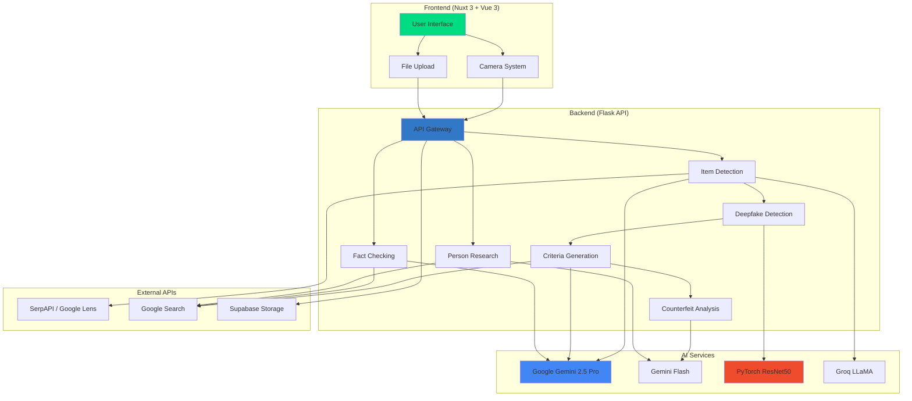
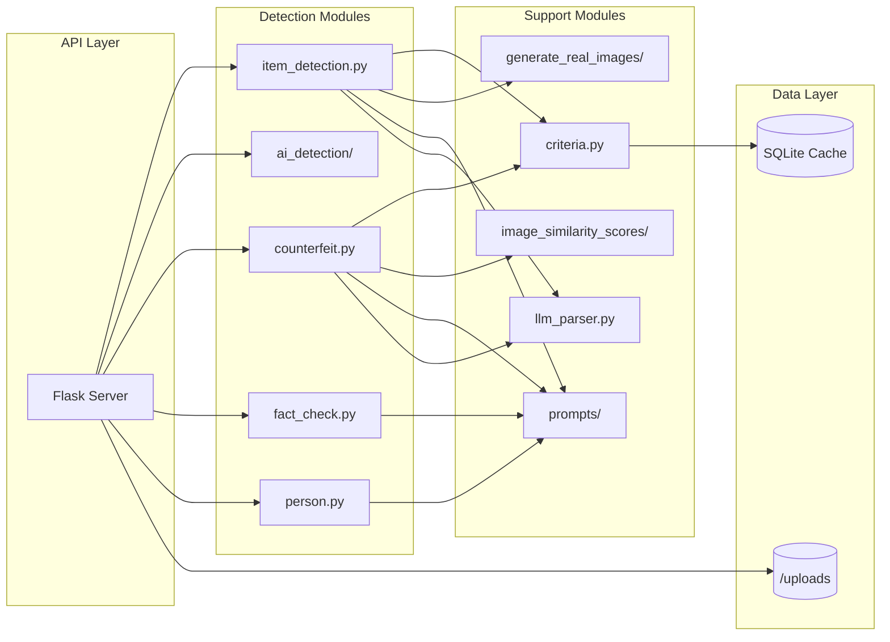
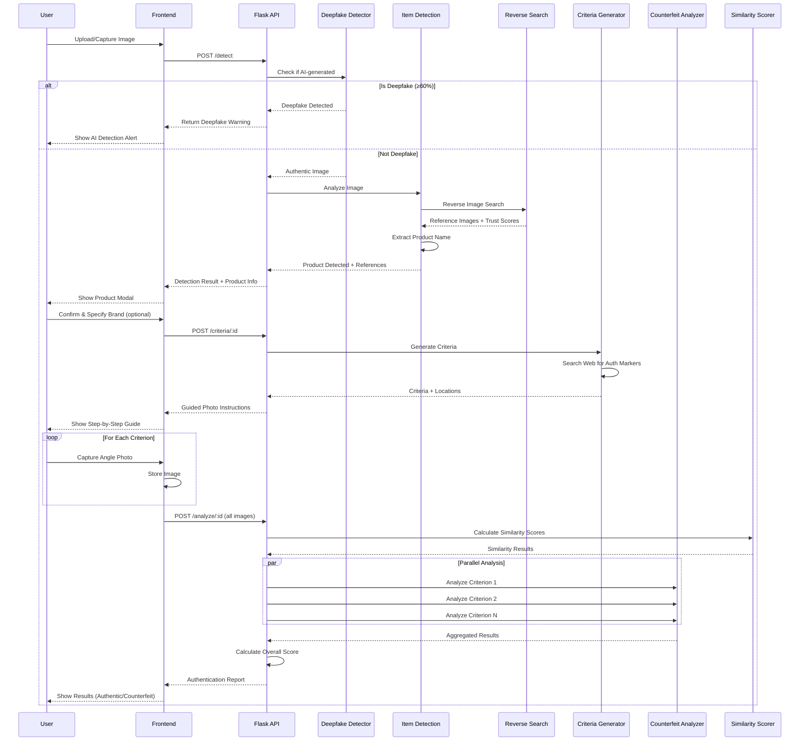
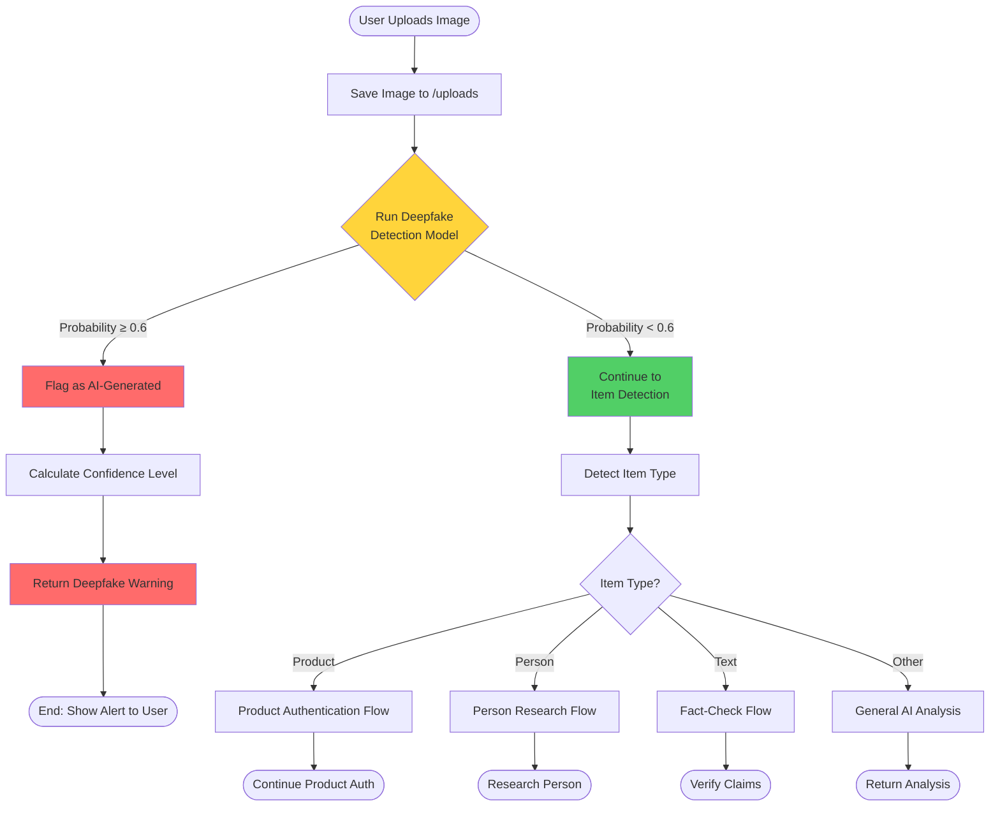
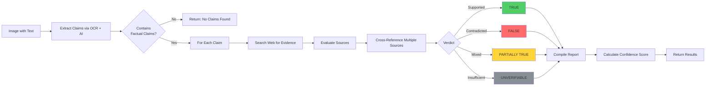
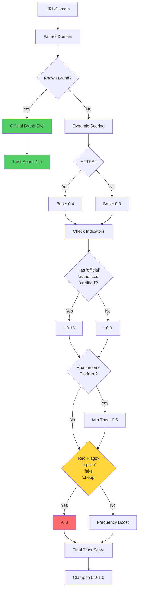

<div align="center">



<h1>AI-Powered Authenticity Verification Platform</h1>

<h3>Because in a world full of fakes, authenticity is everything.</h3>

<p>
  <em>Real-time AI • Real information • Real confidence</em>
</p>

<br/>

### 🛠️ Tech Stack


<br/>

### ✨ Core Features

| 🛍️ Product Authentication | 🤖 Deepfake Detection | 📰 Fact Checking | 👤 Person Research |
|:---:|:---:|:---:|:---:|
| Verify luxury goods | Detect AI-generated images | Verify news claims | Background checks |
| Multi-criterion analysis | Custom ResNet50 model | Source credibility | Red flag detection |
| Image similarity scoring | Real-time detection | Web search verification | Fakeness scoring |

<br/>

### 📚 Documentation

[🚀 Quick Start](#-setup--installation) • [📡 API Reference](#-api-documentation) • [🏗️ Architecture](#%EF%B8%8F-architecture) • [🎯 Use Cases](#-use-cases)

<br/>


</div>

---

## 📋 Table of Contents

- [Overview](#-overview)
- [Key Features](#-key-features)
- [Architecture](#-architecture)
- [Workflows](#-workflows)
- [Tech Stack](#-tech-stack)
- [Setup & Installation](#-setup--installation)
- [API Documentation](#-api-documentation)
- [Use Cases](#-use-cases)
- [Project Structure](#-project-structure)
- [Contributing](#-contributing)

---

## 🎯 Overview

**4real?** is a comprehensive, AI-powered authentication system designed to combat counterfeits, deepfakes, and misinformation. The platform leverages multiple cutting-edge AI technologies to verify:

- 🛍️ **Physical Products** - Authenticate luxury goods, sneakers, collectibles, electronics
- 🤖 **AI-Generated Content** - Detect deepfakes and synthetic media
- 📰 **News & Information** - Fact-check claims and verify sources
- 👤 **People** - Research backgrounds and detect red flags

### Why 4real?

In an era where:
- **$4.2 trillion** in counterfeit goods circulate annually
- **96%** of deepfakes are malicious
- **Misinformation** spreads 6x faster than truth

We provide instant, AI-driven verification to help users make informed decisions.

---

## ✨ Key Features

### 1. Product Authentication System
- **Dynamic Criteria Generation** - AI searches the web for brand-specific authentication markers
- **Guided Photo Capture** - Step-by-step instructions for capturing specific angles
- **Multi-Criterion Analysis** - Parallel scoring of stitching, logos, materials, hardware
- **Image Similarity Scoring** - SIFT, color histograms, SSIM, edge detection
- **Trust-Scored References** - Prioritizes official brand sites over resale platforms
- **Real-Time Price Verification** - Validates market value using web search

### 2. Deepfake Detection
- **Custom ResNet50 Model** - Trained on extensive Real/Fake dataset
- **Instant Pre-Check** - Analyzes images before any other processing
- **Configurable Threshold** - Adjustable confidence levels (default: 60%)
- **Multi-Model Support** - Extensible architecture for additional models

### 3. Fact-Checking Engine
- **Claim Extraction** - Automatically identifies factual statements
- **Web Search Verification** - Cross-references with reliable sources
- **Source Credibility Rating** - Evaluates trustworthiness of sources
- **Evidence-Based Verdicts** - TRUE/FALSE/PARTIALLY TRUE with explanations

### 4. Person Research
- **Background Investigation** - Searches for controversies, crimes, records
- **Fakeness Score (0-100)** - Quantifies trustworthiness
- **Red Flag Detection** - Highlights serious concerns
- **Source Citations** - Verifies information reliability

---

## 🏗️ Architecture

### System Overview



### Backend Architecture



---

## 🔄 Workflows

### Product Authentication Flow



### Deepfake Detection Flow



### Fact-Checking Flow



### Trust Scoring System



---

## 🛠️ Tech Stack

### Frontend
- **Framework**: Nuxt 3 (Vue 3)
- **Styling**: Tailwind CSS 4.x
- **State Management**: Vue Composition API
- **Camera**: Native MediaDevices API
- **Deployment**: Vercel/Netlify ready

### Backend
- **Framework**: Flask 3.x
- **AI/ML**:
  - Google Gemini 2.5 Pro (reasoning + search)
  - Google Gemini Flash (vision analysis)
  - Google Gemini 2.0 Flash Lite (item detection)
  - PyTorch 2.0+ (deepfake detection)
  - Groq (LLaMA 3.1) (text processing)
- **Computer Vision**: OpenCV, scikit-image
- **Deep Learning**: ResNet50, EfficientNet
- **Embeddings**: sentence-transformers (MiniLM)
- **APIs**:
  - SerpAPI (Google Lens reverse image search)
  - Supabase (image storage)

### Database
- **Cache**: SQLite (criteria caching)
- **Embeddings**: Semantic similarity search

### DevOps
- **Version Control**: Git
- **Package Management**: pip, npm
- **Environment**: python-dotenv

---

## 🚀 Setup & Installation

### Prerequisites
- Python 3.11+
- Node.js 18+
- API Keys (see below)

### Required API Keys

Create a `.env` file in the `backend/` directory:

```bash
# AI Services
GEMINI_API_KEY=your_gemini_api_key
GROQ_API_KEY=your_groq_api_key

# Search & Storage
SERPAPI_API_KEY=your_serpapi_key
SUPABASE_URL=your_supabase_url
SUPABASE_KEY=your_supabase_key
```

### Backend Setup

```bash
# Navigate to backend
cd backend

# Create virtual environment
python -m venv venv
source venv/bin/activate  # On Windows: venv\Scripts\activate

# Install dependencies
pip install -r requirements.txt

# Run Flask server
python main.py
```

The backend will start on `http://0.0.0.0:5555`

### Frontend Setup

```bash
# Navigate to frontend
cd frontend

# Install dependencies
npm install

# Run development server
npm run dev
```

The frontend will start on `http://localhost:3000`

### Configuration

**Backend Configuration** (`backend/main.py`):
```python
# Adjust deepfake detection threshold
DEEPFAKE_CONFIDENCE_THRESHOLD = 0.6  # Range: 0.0-1.0
```

**Frontend Configuration** (`frontend/nuxt.config.ts`):
```typescript
export default defineNuxtConfig({
  runtimeConfig: {
    public: {
      apiUrl: 'http://localhost:5555'  // Backend URL
    }
  }
})
```

---

## 📡 API Documentation

### Base URL
```
http://localhost:5555
```

### Endpoints

#### 1. Health Check
```http
GET /health
```

**Response:**
```json
{
  "status": "ok",
  "message": "Backend is running"
}
```

---

#### 2. Detect Item
```http
POST /detect
```

**Request Body:**
```json
{
  "image": "data:image/jpeg;base64,/9j/4AAQSkZJRg..."
}
```

**Response (Product):**
```json
{
  "success": true,
  "detection_id": "uuid-here",
  "item": "Nike Air Jordan 1",
  "item_type": "product",
  "confidence": "High",
  "description": "Detected a Nike Air Jordan 1 sneaker",
  "product_url": "https://nike.com/...",
  "product_image": "https://...",
  "price_range": [150.0, 200.0],
  "filename": "upload_20231015.jpg"
}
```

**Response (Deepfake Detected):**
```json
{
  "success": true,
  "is_deepfake": true,
  "deepfake_detection": {
    "is_deepfake": true,
    "probability": 0.87,
    "confidence_level": "high",
    "message": "This image appears to be AI-generated or manipulated."
  }
}
```

**Response (Person):**
```json
{
  "success": true,
  "detection_id": "uuid-here",
  "item_type": "person",
  "awaiting_person_input": true,
  "message": "Person detected. Please provide their name."
}
```

**Response (Text/Document):**
```json
{
  "success": true,
  "detection_id": "uuid-here",
  "item_type": "text",
  "fact_check": {
    "overall_verdict": "FALSE",
    "confidence_score": 0.92,
    "claims": [...]
  }
}
```

---

#### 3. Get Authentication Criteria
```http
POST /criteria/:detection_id
```

**Request Body (Optional):**
```json
{
  "brand": "Louis Vuitton"
}
```

**Response:**
```json
{
  "success": true,
  "detection_id": "uuid-here",
  "item": "Card Holder",
  "location_angle": [
    "Front - Logo Monogram - Capture straight-on view",
    "Back - Stitching Pattern - 45-degree angle",
    "Interior - Date Code - Close-up with good lighting"
  ],
  "detailed_criteria": [
    {
      "primary_feature": "Logo Monogram",
      "primary_location": "Front center",
      "why_important": "Authentic LV monograms have precise spacing",
      "how_to_photograph": "Capture straight-on with even lighting",
      "backup_feature": "Heat Stamp",
      "backup_location": "Interior",
      "backup_how_to_photograph": "Close-up macro shot"
    }
  ]
}
```

---

#### 4. Analyze with Criteria Images
```http
POST /analyze/:detection_id
```

**Request Body:**
```json
{
  "images": [
    "data:image/jpeg;base64,...",
    "data:image/jpeg;base64,...",
    "data:image/jpeg;base64,..."
  ]
}
```

**Response:**
```json
{
  "success": true,
  "detection_id": "uuid-here",
  "item": "LV Card Holder",
  "is_authentic": true,
  "overall_confidence": 0.89,
  "criteria_results": [
    {
      "criterion": "Logo Monogram",
      "score": 5,
      "passed": true,
      "confidence": 0.95,
      "notes": "Monogram spacing is correct...",
      "visual_markers": ["Correct font", "Proper spacing"]
    }
  ],
  "summary": "✅ Item appears AUTHENTIC. Total score: 44/50 (88.0%). 9/10 criteria passed.",
  "initial_scan": {
    "similarity_score": 0.931,
    "match_status": "MATCH",
    "confidence": "High",
    "counterfeit_risk": "Low"
  }
}
```

---

#### 5. Research Person
```http
POST /research_person
```

**Request Body:**
```json
{
  "detection_id": "uuid-here",
  "person_name": "John Doe",
  "additional_info": "CEO of TechCorp"
}
```

**Response:**
```json
{
  "success": true,
  "person_name": "John Doe",
  "person_research": {
    "fakeness_score": 25,
    "overall_assessment": "low_risk",
    "summary": "Some controversies found but overall trustworthy",
    "findings": [
      {
        "title": "Labor dispute settled",
        "category": "legal",
        "severity": "low",
        "verified": true
      }
    ],
    "red_flags": [],
    "positive_notes": ["Long-standing industry reputation"]
  }
}
```

---

## 💡 Use Cases

### E-Commerce & Resale
- Verify luxury goods before purchase (Poshmark, eBay, Grailed)
- Authenticate sneakers (StockX, GOAT validation)
- Check collectibles (trading cards, limited editions)

### Social Media & News
- Detect AI-generated profile pictures
- Fact-check viral claims and screenshots
- Verify news sources

### Personal Safety
- Research people before meetings (dating, business)
- Verify online identities
- Check backgrounds for hiring

### Brand Protection
- Monitor counterfeit products
- Protect intellectual property
- Maintain brand reputation

---

## 📁 Project Structure

```
HackHarvard2025/
├── backend/
│   ├── ai_detection/              # Deepfake detection module
│   │   ├── model.py               # ResNet50 model architecture
│   │   ├── inference.py           # Inference wrapper
│   │   ├── deepfake_model.pth     # Trained model weights
│   │   └── Dataset/               # Training data (Real/Fake)
│   ├── generate_real_images/      # Reverse image search
│   │   ├── image_searcher.py      # Google Lens integration
│   │   ├── trust_scorer.py        # Domain trust scoring
│   │   ├── brand_detector.py      # Brand identification
│   │   └── utils.py               # Helper functions
│   ├── image_similarity_scores/   # Image comparison
│   │   ├── similarity_calculator.py  # Multi-metric scoring
│   │   ├── feature_extractors.py     # SIFT, color, edge
│   │   └── comparison_analyzer.py    # High-level API
│   ├── prompts/                   # AI prompt templates
│   │   ├── criteria.py
│   │   ├── counterfeit.py
│   │   ├── fact_check.py
│   │   └── person.py
│   ├── main.py                    # Flask API server
│   ├── criteria.py                # Criteria generation
│   ├── counterfeit.py             # Counterfeit analysis
│   ├── fact_check.py              # Fact checking
│   ├── person.py                  # Person research
│   ├── item_detection.py          # Item classification
│   ├── llm_parser.py              # JSON parsing
│   ├── upload_image.py            # Supabase integration
│   ├── requirements.txt           # Python dependencies
│   └── criteria_cache.db          # SQLite cache
│
├── frontend/
│   ├── pages/
│   │   ├── index.vue              # Landing page
│   │   └── detect.vue             # Detection interface
│   ├── components/
│   │   ├── CameraView.vue
│   │   ├── CriteriaCapture.vue
│   │   ├── DetectionResults.vue
│   │   ├── AnalysisResults.vue
│   │   ├── DeepfakeResults.vue
│   │   ├── PersonInput.vue
│   │   ├── PersonResults.vue
│   │   └── FactCheckResults.vue
│   ├── assets/
│   │   ├── css/
│   │   └── images/
│   ├── nuxt.config.ts             # Nuxt configuration
│   ├── package.json               # Node dependencies
│   └── tsconfig.json              # TypeScript config
│
└── README.md                      # This file
```

---

## 🎨 Screenshots & Demo

### Landing Page
Beautiful, modern UI showcasing all features with animated elements and feature marquee.

### Detection Flow
1. **Capture** - Take photo or upload image
2. **Detection** - AI identifies the item
3. **Criteria** - Shows authentication checklist
4. **Guided Capture** - Step-by-step photo instructions
5. **Analysis** - Comprehensive authenticity report

### Results Display
- **Authentic**: Green checkmarks, high confidence scores
- **Counterfeit**: Red X marks, detailed failure explanations
- **Deepfake**: Warning alerts with probability scores
- **Fact-Check**: Claim-by-claim verdicts with sources

---

## 🔬 How It Works

### Product Authentication Algorithm

```
1. Image Upload → Deepfake Pre-Check
   ├─ IF deepfake probability ≥ 60% → STOP, show warning
   └─ ELSE → Continue

2. Item Detection (Gemini Vision)
   ├─ Classify: product/person/text/other
   └─ Extract: product name, brand, description

3. Reverse Image Search (Google Lens)
   ├─ Find similar images
   ├─ Extract reference images from trusted sources
   ├─ Calculate trust scores (official brand = 1.0)
   └─ Detect brand from search results

4. Criteria Generation (Gemini + Web Search)
   ├─ Search web for authentication guides
   ├─ Extract key features: logo, stitching, materials
   ├─ Generate photo instructions
   └─ Cache with semantic similarity

5. Guided Photo Capture (Frontend)
   ├─ Show criterion 1 → Capture
   ├─ Show criterion 2 → Capture
   └─ ... → Submit all images

6. Parallel Analysis (ThreadPoolExecutor)
   ├─ Criterion 1 → Gemini Flash → Score 1-5
   ├─ Criterion 2 → Gemini Flash → Score 1-5
   └─ Criterion N → Gemini Flash → Score 1-5

7. Image Similarity (OpenCV)
   ├─ SIFT feature matching (25%)
   ├─ Color histogram (35%)
   ├─ SSIM structural (20%)
   ├─ Edge detection (15%)
   └─ Shape analysis (5%)

8. Final Verdict
   ├─ Aggregate scores → Overall confidence
   ├─ Calculate risk level
   ├─ Generate recommendations
   └─ Return report to user
```

### Trust Scoring Formula

```python
base_score = 0.3  # Unknown domains

# Factors:
+ 1.0   if official brand domain (hardcoded)
+ 0.1   if HTTPS
+ 0.15  if 'official', 'authorized', 'certified' in domain
+ 0.5   if e-commerce platform (Amazon, eBay, etc.)
- 0.3   if 'replica', 'fake', 'cheap' in domain/path
+ 0.15  if domain appears 3+ times in results
+ 0.08  if domain appears 2 times

final_score = clamp(base_score + adjustments, 0.0, 1.0)
```

---

## 🧪 Testing

### Backend Tests
```bash
cd backend

# Test reverse image search
python test_materials/test_reverse_search.py

# Test similarity scoring
python test_materials/example_similarity_usage.py

# Test item detection
python item_detection.py

# Test fact checking
python fact_check.py test_materials/fact_check.png
```

### Model Testing
```bash
# Test deepfake detection
cd backend/ai_detection
python inference.py path/to/image.jpg deepfake_model.pth
```

---

## 🚧 Known Limitations

1. **Deepfake Model** - Trained on specific dataset, may need retraining for new generation methods
2. **Criteria Quality** - Depends on web search results availability
3. **API Rate Limits** - SerpAPI, Gemini have usage quotas
4. **Image Quality** - Poor lighting/focus affects accuracy
5. **Brand Coverage** - Limited to ~40 major brands (expandable)

---

## 🛣️ Roadmap

### Phase 1 (Current)
- [x] Product authentication
- [x] Deepfake detection
- [x] Fact checking
- [x] Person research
- [x] Web interface

### Phase 2 (Planned)
- [ ] Mobile app (React Native)
- [ ] Browser extension
- [ ] QR code verification
- [ ] Blockchain certificate storage
- [ ] Batch processing API

### Phase 3 (Future)
- [ ] Community reports database
- [ ] Machine learning feedback loop
- [ ] Real-time video analysis
- [ ] Marketplace integrations (eBay, Poshmark)
- [ ] Professional authentication service

---

## 🤝 Contributing

Contributions are welcome! This project was built for HackHarvard 2025.

### Adding New Brands
Edit `backend/generate_real_images/config.py`:
```python
KNOWN_BRANDS = {
    'new brand': 'newbrand.com'
}

TRUST_SCORES = {
    'newbrand.com': 1.0
}
```

### Adding New Detection Types
1. Create new module in `backend/`
2. Add endpoint in `main.py`
3. Create Vue component in `frontend/components/`
4. Update detection flow in `detect.vue`

---

## 📄 License

This project was created for HackHarvard 2025. All rights reserved.

---

## 👥 Team

Built with ❤️ by the **4real?** team at HackHarvard 2025.

---

## 🙏 Acknowledgments

- Google for Gemini API access
- SerpAPI for reverse image search
- PyTorch community for model architectures
- Vue.js & Nuxt teams for amazing frameworks
- OpenCV contributors

---

## 📞 Support

For questions or issues:
1. Check the documentation above
2. Review test files for examples
3. Check API response formats

---

<div align="center">

**Don't Get Fooled. Know What's 4real.**

Made with 🔍 at HackHarvard 2025

</div>
